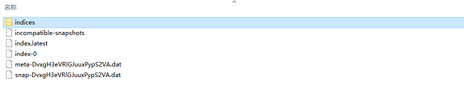

## 方式1，快照

### 修改配置文件

修改配置文件，增加快照仓库地址：

```properties
path.repo: ["/usr/local/soc/elasticsearch-5.5.0/data/backup/local/es"]
```

或者，window下注意是双斜杠

```properties
path.repo: ["D:\\tools\\elasticsearch-5.5.0-l\\data\\backup"]
```

### 创建快照仓库

类型`type`使用本地文件系统，还有很多其他的；`location`设置上面配置文件中的路径下面

```properties
curl --location --request PUT 'http://127.0.0.1:9200/_snapshot/backup' \
--header 'Content-Type: application/json' \
--data-raw '{
    "type": "fs",
    "settings": {
        "location": "D:\\tools\\elasticsearch-5.5.0\\data\\backup\\001"
    }
}'
```

### 创建快照

```properties
curl --location --request PUT 'http://127.0.0.1:9200/_snapshot/backup/001' \
--header 'Content-Type: application/json' \
--data-raw '{
    // 备份部分索引指定索引名称，逗号隔开
    // "indices": "index_1,index_2" 
    "ignore_unavailable": true,
    "include_global_state": false
}'
```

等待执行完毕后，会在对应的文件下产生快照文件，如下所示的样子：



### 还原快照

```properties
curl --location --request POST 'http://127.0.0.1:9200/_snapshot/backup/061702/_restore'
```

