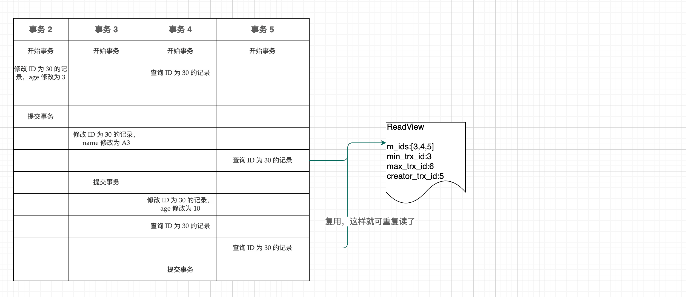

## InnoDB

### 逻辑存储结构

**表空间（ibd 文件）：**一个 mysql 示例可以对应多个表空间，用于存储记录，索引等数据。

**段：**分为数据段（Leaf node segment），索引段（Non-leaf node segment），回滚段（Rollback segment）。InnoDB 是索引组织表，数据库段就是叶子节点，索引段就是非叶子节点。段用来管理多个区。

**区：**表空间的单元结构，每个区的大小为 1M，默认情况下，InnoDB的每个页的大小为 16k，即一个区中有联系 64 个页。

**页：**InnoDB磁盘管理的最小单位，每个页的大小是 16k。为了保证页的连续性，InnoDB每次从磁盘申请 4~5 个区。我们的数据和索引就存储在这个位置上。

**行：**数据按照行进行存放。（其中的 Trx id 是最后一次事务的 ID；roll pointer 版本记录指针，这俩都是隐藏字段，后面会说作用）

### 事务原理

事务：一组操作的即可，是不可分割的一部分，这些操作要么都成功要么都失败。

特性：

- 原子性（Atomicity）：事务是不可分割的最小操作单元，要么全部成功，要么全部失败
- 一致性（C）：事务完成后，必须保证所有的数据都保持一致
- 隔离性（I）：隔离机制，不受外部并发操作的影响
- 持久性（D）：事务一旦提交或者回滚，对数据库中的改变都是永久的

Mysql 是如何完成事务的？主要通过两类 log 来实现原子，一致，可用；锁和 MVCC 实现隔离。

**redo log**

重做日志，记录的是事务提交后数据页的物理修改，用来实现事务的持久性。

该日志文件分为两部分：重做缓存日志（redo log buffer）,重做日志文件（redo log file）,前者在内存中，后者在内存中。当事务提交后会把修改的信息存储到该日志中，用于在刷新脏页到磁盘发生错误的时候，进行数据恢复使用。

**undo log**

回滚日志，记录数据被修改前的信息，作用：提供回滚和 MVCC（多版本并发访问）。

undo log 和 redo log 物理日志不一样，它记录的是逻辑日志。例如执行delete一条数据的时候，undo log记录的是插入这一条数据。

undo log 采用段的方式进行存储和管理，放在rollback segment 回滚段中，内部包含1024 个undo log segment

### MVCC

#### 概念

**当前读**

读取的是记录的最新版本，读取的时候还需要保证其他事务不能修改当前事务，会对读取的记录加锁。例如我们日常的操作中：select ... lock in share mode （共享锁），select ... for update /insert /delete （排它锁）

**快照读**

简单的 select 不加锁就是快照读。它读取的是记录的可见版本，有可能是历史版本，不加锁，是非阻塞读。

- Read committed  每次select，都生成一个快照读
- Repeatable Read 开启事务后第一个select语句才是快照读的地方
- Serializable  快照读会退化成当前读

**MVCC**

全称 Multi-Version Concurrency Control 多版本并发控制。维护一个数据的多个版本，使读写操作没有冲突，快照读为 mysql实现MVCC提供了一个非阻塞读的功能。MVCC 具体实现还需要数据库记录中的三个部分：表中三个隐藏字段，undo log日志，readview。

#### 实现原理

##### 隐藏字段

| 隐藏字段    | 含义                                                         |
| ----------- | ------------------------------------------------------------ |
| DB_TRX_ID   | 最近事务 ID，记录插入或者修改这条记录的事务 ID               |
| DB_ROLL_PTR | 回滚指针，指向这条记录的上个版本，配置 undo log 指向上个版本的记录 |
| DB_ROW_ID   | 隐藏主键，如果表结构没有指定主键，将会生成该隐藏字段         |

**undo log 日志**

回滚日志，在 insert update delete 的时候产生的便于回滚记录的日志。

- 当 insert的时候，产生的 undo log 日志在回滚的时候需要，在事务提交后，可被立即删除。

- 当 update delete的时候，产生的 undo log 日志不仅在回滚的时候需要，在快照读的时候也需要，事务提交后不会被立即删除。

##### undo log 版本链

原始记录如下：

| id   | age  | name |
| ---- | ---- | ---- |
| 30   | 30   | A30  |

假如有如下事务，undo log 版本链如何生成。

| 事务 2                             | 事务 3                               | 事务 4                              | 事务 5               |
| ---------------------------------- | ------------------------------------ | ----------------------------------- | -------------------- |
| 开始事务                           | 开始事务                             | 开始事务                            | 开始事务             |
| 修改 ID 为 30 的记录，age 修改为 3 |                                      | 查询 ID 为 30 的记录                |                      |
|                                    |                                      |                                     |                      |
| 提交事务                           |                                      |                                     |                      |
|                                    | 修改 ID 为 30 的记录，name 修改为 A3 |                                     |                      |
|                                    |                                      |                                     | 查询 ID 为 30 的记录 |
|                                    | 提交事务                             |                                     |                      |
|                                    |                                      | 修改 ID 为 30 的记录，age 修改为 10 |                      |
|                                    |                                      | 查询 ID 为 30 的记录                |                      |
|                                    |                                      |                                     | 查询 ID 为 30 的记录 |
|                                    |                                      | 提交事务                            |                      |

undo log 版本链生成过程如下所示：

不同事务对同一条记录进行修改，会使该记录的 undo log 生成一条记录版本链表，表头是最新的就记录，尾部是最旧的记录。

##### readview

我们有了undo log 版本链，那么如何知道我这个事务需要读个哪个版本的快照数据呢？这个就需要 readview 来完成。

ReadView（读视图）是快照读 SQL 执行 MVCC提取数据的依据，记录并维护系统当前活跃的事务（未提交）ID.

其主要包含了四个核心字段：

| 字段           | 说明                                                 |
| -------------- | ---------------------------------------------------- |
| m_ids          | 当前活跃的事务 ID 集合                               |
| min_trx_id     | 最小活跃事务 ID                                      |
| max_trx_id     | 预分配事务 ID,当前最大事务 ID+1 （事务 ID 是自增的） |
| creator_trx_id | readview创建者的事务 ID                              |

那么具体是如何提取的？规则如下所示：

trx_id : 代表当前事务 ID

| 规则                           | 是否可以访问该版本 | 说明                                                         |
| ------------------------------ | ------------------ | ------------------------------------------------------------ |
| trx_id == creator_trx_id       | √                  | 当前事务的 ID 和 创建者的事务 ID 一样，说明自己的事务当然可以访问 |
| trx_id < min_trx_id            | √                  | 小于最小的事务 ID，说明当前事务已经提交了，可以访问          |
| trx>max_trx_id                 | ×                  | 说明事务在 readview后才开启                                  |
| min_trx_id<=trx_id<=max_trx_id |                    | 如果 trx_id 不在 m_ids 中可以访问该版本，因为事务已经提交    |

在 RR 隔离级别下，仅在事务第一次执行快照读时候生成 readview 后序复用该 readview。

得到 readview 然后套用上面的规则，就会得到该事务可以读取数据的版本。

