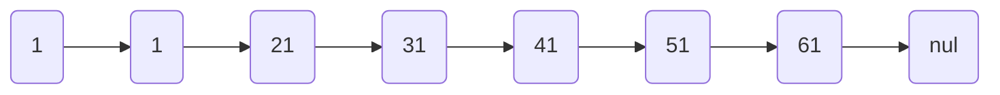

## 字符串-String

String类型是二进制安全的，可以包含任何数据，例如jpg 图片或者序列化的对象。一个字符串的 value 可以最大为 512M。

### 常用命令

| 命令                       | 说明                               | 备注                                                         |
| -------------------------- | ---------------------------------- | ------------------------------------------------------------ |
| set key value              | 添加                               | 设置相同的 key 更新 value 的值                               |
| get key                    | 获取                               |                                                              |
| append key value           | 追加                               | 如果 key 不存在，添加为 value                                |
| strlen key                 | 查询值的长度                       |                                                              |
| setnx                      | 当 key 不存在时，设置 value        |                                                              |
| incr key                   | 将 key 中存储的数字+1              |                                                              |
| decr key                   | 将 key 中存储的数字-1              |                                                              |
| incrby /  decrby key  num  | 增加或者减少指定的步长（原子操作） |                                                              |
| mset k1 v1 k2 v2 k3 v3     | 批量添加多个                       | 127.0.0.1:6379> mset k1 v1 k2 v2 k3 v2                       |
| mget k1 k2 k3              | 批量获取多个 key                   | 127.0.0.1:6379> mget k1 k2 k3 1) "v1" 2) "v2" 3) "v2" |
| msetnx k1 v1 k2 v2         | 批量设置不存在的key,一个失败都失败 |                                                              |
| getrange key start end     | 获取范围的值                       | 127.0.0.1:6379> getrange name 0 2 "123"                  |
| setrange key  offset value | 指定位置设置值                     | 127.0.0.1:6379> setrange name 0 hh                           |
| setex key 过期时间 value   | 设置key及获取时间                  |                                                              |
| getset key value           | 设置新值，同时获取旧值             | 127.0.0.1:6379> getset k1 helloworld "v1"                |

### 数据结构

简单动态字符串，内部结构实现类似于 JAVA 的 ArrayList，采用预分配空的方式减少内存的分配。如果字符串长度超过容量，扩容自己的容量，如果超过 1M，扩容一次只会多扩容 1M 的空间。多大为 512M。

## 列表-List

单键多值，是简单的字符串列表，按照插入的顺序排序。可以将元素添加到列表的头部（左边）或者尾部（右边）。底层是是个双向的列表，对两端的操作性能很高，通过索引下标操作中间的数据性能较差。

### 常用命令

| 命令                                     | 说明                                          | 备注                                                         |
| ---------------------------------------- | --------------------------------------------- | ------------------------------------------------------------ |
| lpush / rpush key v1 v2 v3               | 左侧/右侧插入数据                             | 127.0.0.1:6379> lpush k1 1 2 3 4 (integer) 4             |
| lpop / rpop key                          | 从左侧/右侧取出一个值。（键在值在，值光键亡） | 127.0.0.1:6379> lpop k1 "4"                              |
| rpoplpush k1 k2                          | 从 k1列表右侧取一个值，插入到k2 的左侧        | 127.0.0.1:6379> lpush k1 1 2 3 (integer) 3 127.0.0.1:6379> lpush k2 a b c (integer) 3 127.0.0.1:6379> rpoplpush k1 k2 "1" 127.0.0.1:6379> lrange k2 0 -1 1) "1" 2) "c" 3) "b" 4) "a" |
| lrange key start end                     | 取指定范围内的值。0 -1 表示所有值。           | 127.0.0.1:6379> lrange k1 0 -1 1) "4" 2) "3" 3) "2" 4) "1" |
| llen key                                 | 获取列表长度                                  | 127.0.0.1:6379> llen k2 (integer) 4                      |
| linsert key after/before value new value | 在指定值的前/后增加一个新的值                 | 127.0.0.1:6379> lpush k1 1 2 3 (integer) 3 127.0.0.1:6379> linsert k1 after 1 a (integer) 4 127.0.0.1:6379> lrange k1 0 -1 1) "3" 2) "2" 3) "1" 4) "a" |
| lrem key n vaule                         | 从左到右删除 n 个 value                       | 127.0.0.1:6379> lpush k1 1 1 2 2 (integer) 4 127.0.0.1:6379> lrem k1 2 1 (integer) 2 127.0.0.1:6379> lrange k1 0 -1 1) "2" 2) "2" |
| lset key index value                     | 将列表下标 index 的值替换成 value             | 127.0.0.1:6379> lset k1 0 a OK 127.0.0.1:6379> lrange k1 0 -1 1) "a" 2) "2" |

### 数据结构

List 数据结构是快速链表 quickList。首先在列表元素较少的情况下会使用一块连续的内存存储，这个结构是 ziplist，压缩列表。

当数据量较大的时候才会变成 quickList。因为普通的链表还需要指针的空间，会浪费空间。

Redis 将链表和 zipList 结合起来组成了 quickList，使用双向指针将多个 ziplist串起来。这样既满足了快速的插入删除又不会有太大的空间冗余。

## 集合-Set

不重复的集合。

### 常用命令

| 命令                | 说明                            | 备注                                                         |
| ------------------- | ------------------------------- | ------------------------------------------------------------ |
| sadd key v1 v2      | 添加                            | 127.0.0.1:6379> sadd k2 1 2 3 (integer) 3                |
| smembers            | 取出所有值                      | 127.0.0.1:6379> smembers k2 1) "1" 2) "2" 3) "3" |
| sismember key value | 判断是否有 value，1 有 0无      | 127.0.0.1:6379> sismember k2 1 (integer) 1               |
| scard key           | 集合元素个数                    | 127.0.0.1:6379> scard k2 (integer) 3                     |
| srem key v1 v2      | 删除集合元素                    | 127.0.0.1:6379> srem k2 1 2 (integer) 2                  |
| spop key            | 随机吐出一个值                  | 127.0.0.1:6379> spop k2 "4"                              |
| srandmember key n   | 随机取出 n 个值，不会集合删除   | 127.0.0.1:6379> srandmember k2 2 1) "3" 2) "56"      |
| smove src dst value | 把集合中的一个值从src移动到 dst | 127.0.0.1:6379> sadd k1 1 2 (integer) 2 127.0.0.1:6379> sadd k2 3 4 (integer) 2 127.0.0.1:6379> smove k1 k2 2 |
| sinter k1 k2        | 两个集合的交集                  | 127.0.0.1:6379> sadd k1 1 2 (integer) 2 127.0.0.1:6379> sadd k2 2 3 (integer) 2 127.0.0.1:6379> sinter k1 k2 1) "2" 127.0.0.1:6379> |
| sunion k1 k2        | 并集                            | 127.0.0.1:6379> sunion k1 k2 1) "1" 2) "2" 3) "3" |
| sdiff k1 k2         | 差集，k1中的，不包含k2 中的     | 127.0.0.1:6379> sdiff k1 k2 1) "1"                       |

### 数据结构

Set数据结构为 dist，字典是用 hash 表实现的。内部使用的 Hash结构，所有的 value 都指向同一个内部值。

## 哈希-Hash

redis hash 是一个键值集合，一个 String 类型的 k v 映射表，特别适合用于存储对象。

### 常用命令

| 命令                   | 说明                                            | 备注                                                      |
| ---------------------- | ----------------------------------------------- | --------------------------------------------------------- |
| hset key field value   | 添加                                            | 127.0.0.1:6379> hset user name jerry (integer) 1      |
| hget key field         | 取值                                            | 127.0.0.1:6379> hget user name "jerry"                |
| hmset key f1 v1 f2 v2  | 批量添加                                        | 127.0.0.1:6379> hset user name tom age 18 (integer) 1 |
| hexists key f          | 判断 f是否存在                                  | 127.0.0.1:6379> hexists user name (integer) 1         |
| hkeys key              | 列出 hash 中所有 field                          | 127.0.0.1:6379> hkeys user 1) "name" 2) "age"     |
| hvals key              | 列出 hash 中所有 value                          | 127.0.0.1:6379> hvals user 1) "tom" 2) "18"       |
| hincrby key field num  | 给 field字段的值增加 num                        |                                                           |
| hsetnx key field value | 给 hash 表中 filed 字段设置值（field 不存在的） |                                                           |

### 数据结构

当 field-value 长度短并且个数较少时，使用 ziplist，否则使用 hashtable。

## 有序集合-Zset

与 set 相似，是一个没有重复元素的字符串集合，不同之处为其中每个成员都关联了一个评分(score)，用来从高到低方式排序集合中的成员。集合中的元素是唯一的，但是评分是可以重复的。

### 常用命令

| 命令                                                         | 说明                                      | 备注                                                         |
| ------------------------------------------------------------ | ----------------------------------------- | ------------------------------------------------------------ |
| zadd key score1 v1 score2 v2                                 | 加入结合                                  | 127.0.0.1:6379> zadd k1 5 v1 6 v2 7 v3 (integer) 3       |
| zrange key start en [withscores]                             | 返回下标在 start end 之间的元素，带分数   | 127.0.0.1:6379> zrange k1 0 -1 withscores 1) "v1" 2) "5" 3) "v2" 4) "6" 5) "v3" 6) "7" |
| zrangebyscores key min max [withscores] [limit offset count] | scorezai min max 之间的成员，递增排序返回 | 127.0.0.1:6379> zrangebyscore k1 6 10 1) "v2" 2) "v3" |
| zrevrangebyscores key max min [withscores] [limit offset count] | 从大到小排序                              | 127.0.0.1:6379> zrevrangebyscore k1 10 5 1) "v3" 2) "v2" 3) "v1" |
| zincrby key increment value                                  | 元素的 score 加上增量                     | 127.0.0.1:6379> zincrby k1 50 v1 "55"                    |
| zrem key value                                               | 删除指定的元素                            | 127.0.0.1:6379> zrem k1 v2 (integer) 1                   |
| zcount key min max                                           | 统计区间内元素个数                        | 127.0.0.1:6379> zcount k1 10 100 (integer) 1             |
| zrank key value                                              | 返回值在集合中的排名，从 0 开始           | 127.0.0.1:6379> zrank k1 v1 (integer) 1                  |

### 数据结构

底层是用了两个数据结构

Hash ，用于关联 value 和 score，保障元素 value 的唯一性，也可以通过 value 找到对应的 score

跳跃表，用于给元素 value 排序，根据 score 的范围获取元素。

普通的有序列链表

跳跃表

