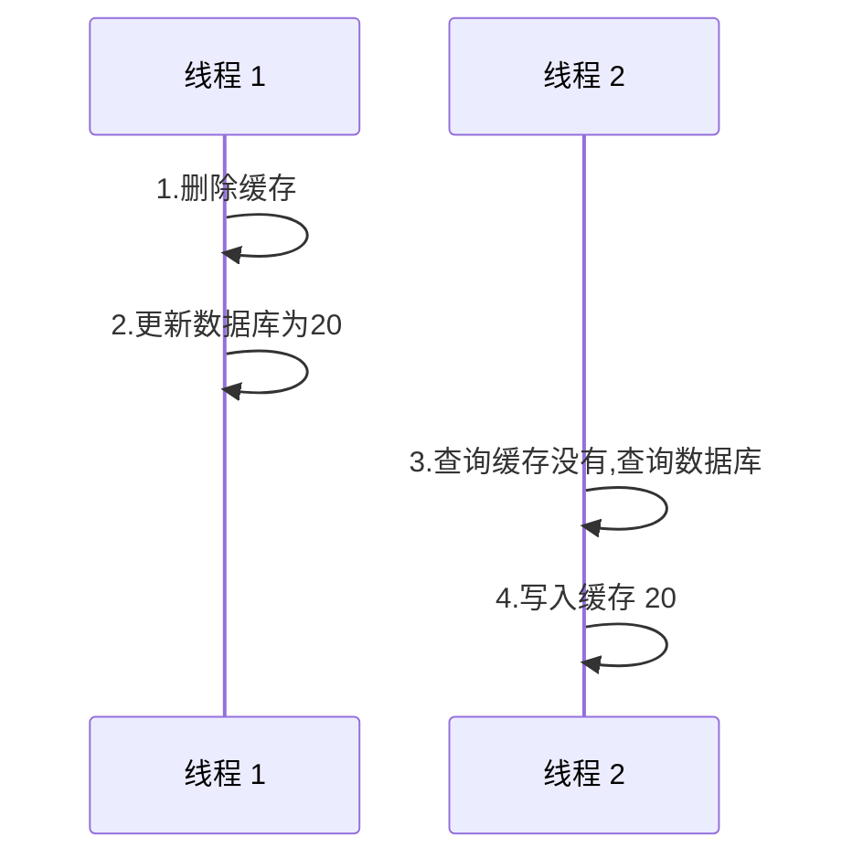
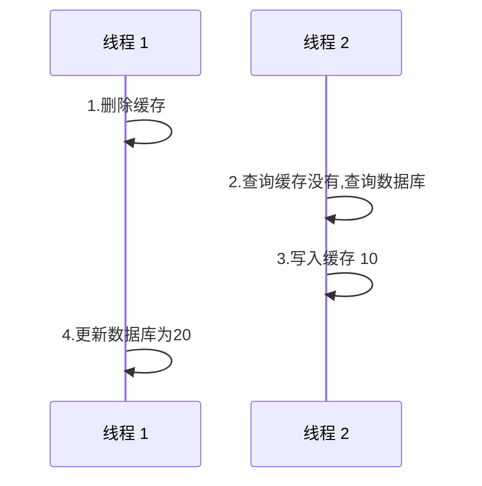
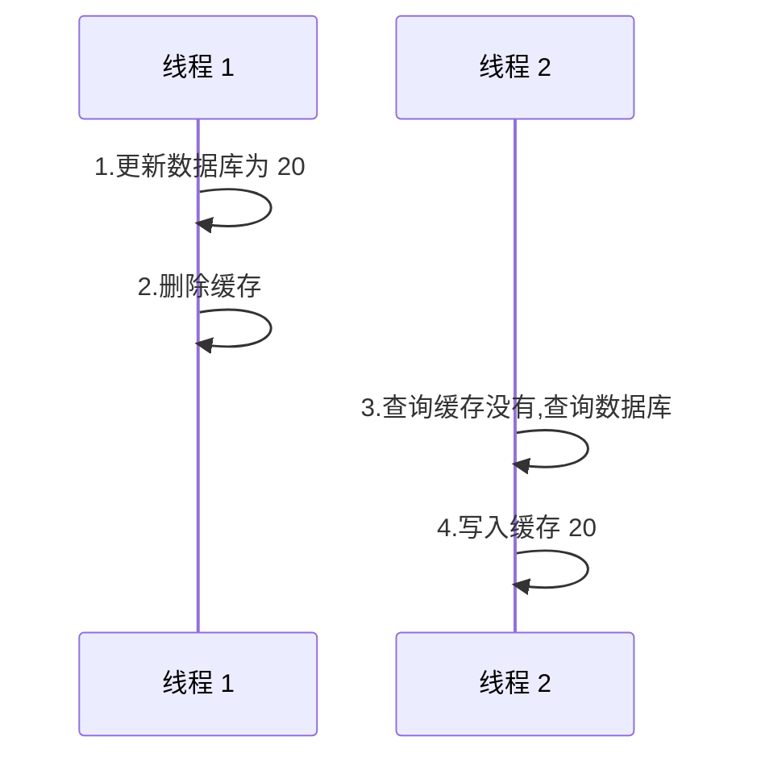
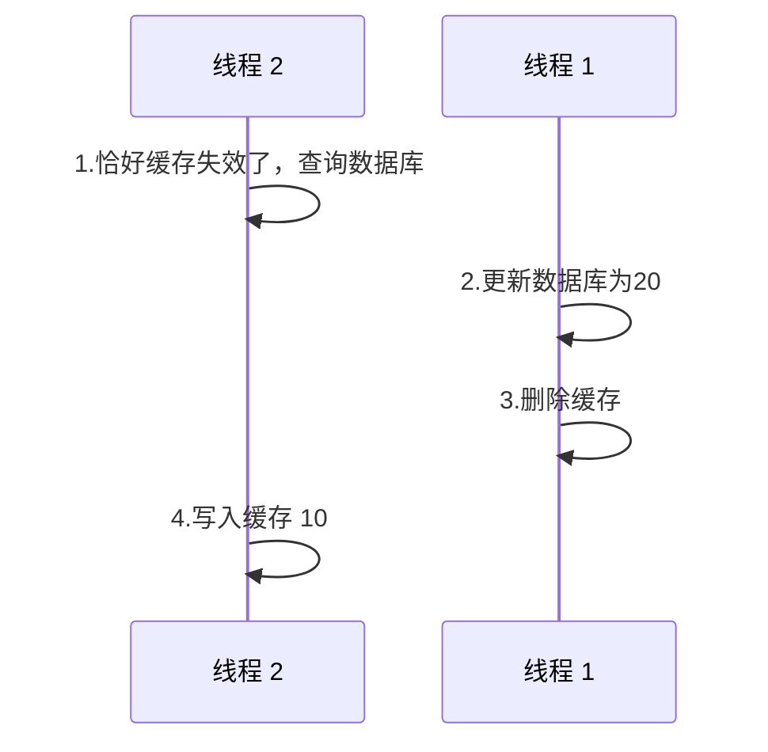

## 更新策略

| 策略类型     | 说明                                                   | 一致性 | 维护成本 |
| ------------ | ------------------------------------------------------ | ------ | -------- |
| 内存淘汰     | redis 自带内存淘汰机制，当内存不足的时候会自动淘汰数据 | 差     | 无       |
| 超时自动剔除 | 给数据设置超时时间，到期后自动删除，下次查询更新       | 一般   | 低       |
| 主动更新     | 需要人为的编写业务逻辑，在修改数据库的同时修改更新缓存 | 好     | 高       |

低一致性：使用redis 自带的内存淘汰即可

高一致性：选择主动更新，并给数据设置超时时间以防万一

## 主动更新的策略

- Cache Asside Pattern 

  由缓存的调用者，在更新数据库的同时，更新缓存数据

- Read/Write Through Pattern

  将数据库和缓存的操作整合为一个服务来维护一致性，调用者使用该服务，不需要关心缓存的问题

- Write behind Caching Pattern

  调用者只操作缓存，有其他的异步服务将数据持久化到数据库中，保证最终一致性

?> 后面两个方案都需要手动的去维护一个独立的服务去操作缓存数据，又没有现成的解决方案，成本很高！所以第一种方案是最可行的。

## 更新缓存？删除缓存？ 

### 如何选择？

- 更新缓存：

​	每次更新数据库，都更新缓存，无效的写比较多。（如果是个复杂的逻辑业务才能生成缓存，那么多次的写会消耗性能）

- 删除缓存：

​	更新数据库，让缓存失效，查询的时候再更新缓存   √

### 双写原子性 ？

单体系统：将缓存和 DB 操作放在同一个事务内

分布式系统：将缓存和 DB 操作放在分布式事务中

### 先操作数据库还是先操作缓存？

假如 `缓存：10` `数据库 10`

<!--  panels:start   -->

<!--  div:title-panel  -->

**先删除缓存，再操作数据库。**

<!--  div:left-panel  -->

正常的流程，线程1 删除缓存，更新数据库为 20。线程 2 将缓存更新为 20。

<!--  div:right-panel  -->

  异常的情况，线程 1 还没有操作完毕，线程 2 将缓存设置为 10，线程 1 最终将 DB 更新为 20。结果缓存和 DB 不一致。

<!--  panels:end  -->

!>删除和查询缓存是非常快的，但是写入数据库的速度就没有那么快了，所以上面异常的情况还是很容易出现的。

<!--  panels:start   -->

<!--  div:title-panel  -->

**先操作数据库，再删除缓存**

<!--  div:left-panel  -->

正常的流程，线程1 删除缓存，更新数据库为 20。线程 2 将缓存更新为 20。

<!--  div:right-panel  -->

异常的情况，线程2 查询的时候恰好失效了，然后就去查询数据库得到 10，这个时候线程 1 把数据更新为 20 了，同时删除了缓存。最终 DB 和缓存又不一致了。

<!--  panels:end  -->

异常发生的条件： 多个线程并发，恰好缓存失效，一个线程在更新缓存的时候，恰好另一个线程更新了库删删除了缓存。（但是在写入缓存的这个极短的时间内，做完更新DB删除缓存可能性不是很高。）

所以` 先操作数据库，再删除缓存` 这种方案比较可行。

