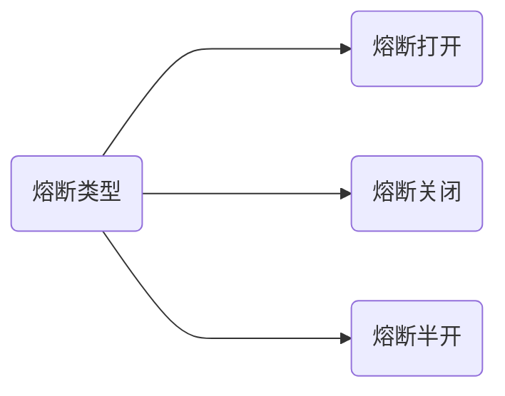

Hystrix

开源地址：https://github.com/Netflix/Hystrix   停止更新  `Hystrix is no longer in active development, and is currently in maintenance mode.`

文档就是 wiki ：https://github.com/Netflix/Hystrix/wiki

## 概述

分布式系统的问题&Hystrix

服务调用链路非常复杂，如果其中一个服务出现问题，就可能导致整个服务不可用。Hystrix 是一个分布式系统的延迟和容错的开源库，它能保证在一个依赖服务出现问题的时候，不会导致整体服务失败，避免级联故障，提高分布式系统的弹性。


熔断器是一种开关装置，当某个服务单元发生故障后，通过断路器的故障监控，向调用方返回一个符合预期的，可处理的备选响应，而不是长时间的等待或者抛出无法处理的异常。这样保证了调用方的线程不会被长时间的占用，从而避免了故障的蔓延。


## 主要功能及概念

### 服务降级

如果服务不可用，立刻给调用方一个友好的提示。服务fallback。

哪些情况会发生服务降级？

- 程序运行异常
- 超时
- 服务熔断触发服务降级
- 线程池满
- .......

### 服务熔断

直接拒绝访问，然后调用服务降级的方法给出友好提示。服务直接 break。

### 服务限流

控制流量，比如一秒只能操作 N 个，其余的排队。

### 实时监控

提供监控页面


## 入门使用-服务降级

如果服务提供者出现问题，可能胡返回错误页面

```java
Whitelabel Error Page
This application has no explicit mapping for /error, so you are seeing this as a fallback.

Tue Apr 06 10:43:44 CST 2022
There was an unexpected error (type=Internal Server Error, status=500).
```


### 服务降级-生产者

业务类启用

通过@HystrixCommand 注解，其中@HystrixProperty中的参数可以从`HystrixPropertiesManager` 查看

```java
package cn.lichenghao.springcloud.service.impl;

import cn.lichenghao.springcloud.service.PaymentService;
import com.netflix.hystrix.contrib.javanica.annotation.HystrixCommand;
import com.netflix.hystrix.contrib.javanica.annotation.HystrixProperty;
import org.springframework.stereotype.Service;

import java.util.concurrent.TimeUnit;

@Service
public class PaymentServiceImpl implements PaymentService {

    @Override
    public String paymentOk(Integer id) {
        return Thread.currentThread().getName() + " paymentOk:" + id;
    }

    @HystrixCommand(fallbackMethod = "paymentTimeOutHandler", commandProperties = {
            @HystrixProperty(name = "execution.isolation.thread.timeoutInMilliseconds", value = "3000")
    })
    @Override
    public String paymentTimeOut(Integer id) {
        try {
            TimeUnit.SECONDS.sleep(5);
        } catch (InterruptedException e) {
            throw new RuntimeException(e);
        }
        return Thread.currentThread().getName() + " paymentTimeOut:" + id;
    }

    public String paymentTimeOutHandler(Integer id) {
        return Thread.currentThread().getName() + " paymentTimeOutHandler:" + id;
    }
}
```


启动类启用，通过注解 `@EnableCircuitBreaker`

```java
/**
 * 带服务降级和熔断器的服务
 */
@SpringBootApplication
@EnableEurekaClient
@EnableCircuitBreaker
public class HystrixPayment8001 {
    public static void main(String[] args) {
        SpringApplication.run(HystrixPayment8001.class, args);
    }
}
```


如果我们的程序出现运行时异常，那么也会走服务降级。

```java
@HystrixCommand(fallbackMethod = "paymentTimeOutHandler", commandProperties = {
            @HystrixProperty(name = "execution.isolation.thread.timeoutInMilliseconds", value = "3000")
    })
    @Override
    public String paymentTimeOut(Integer id) {
        int a = 1 / 0; //模拟
        try {
            TimeUnit.SECONDS.sleep(5);
        } catch (InterruptedException e) {
            throw new RuntimeException(e);
        }
        return Thread.currentThread().getName() + " paymentTimeOut:" + id;
    }

    public String paymentTimeOutHandler(Integer id) {
        return Thread.currentThread().getName() + " paymentTimeOutHandler:" + id;
    }
```


> 小结论：服务出现超时或者运行时异常，都会走我们的服务降级逻辑，走我们的paymentTimeOutHandler方法。

### 服务降级-消费者

 启用配置 feign.hystrix.enable=true

```yaml
server:
  port: 80

eureka:
  client:
    # 注册进中心
    register-with-eureka: false
    # 从 Eureka Server 抓取自己的注册信息。单机无所谓，集权环境下必须为ture。
    fetch-registry: true
    service-url:
      defaultZone: http://localhost:6001/eureka

feign:
  hystrix:
    enabled: true
```

启动类 @EnableHystrix

```java
@SpringBootApplication
@EnableFeignClients
@EnableHystrix
public class HystrixOrder {
    public static void main(String[] args) {
        SpringApplication.run(HystrixOrder.class, args);
    }
}
```

业务类

```java
@RestController
@RequestMapping("/order/payment/hystrix")
public class PaymentController {

    @Resource
    private PaymentService paymentService;

    @GetMapping("/ok/{id}")
    public String paymentOk(@PathVariable("id") Integer id) {
        return paymentService.paymentOk(id);
    }

    @HystrixCommand(fallbackMethod = "paymentTimeOutHandler", commandProperties = {
            @HystrixProperty(name = "execution.isolation.thread.timeoutInMilliseconds", value = "2000")
    })
    @GetMapping("/timeout/{id}")
    public String timeout(@PathVariable("id") Integer id) {
        return paymentService.timeout(id);
    }

    public String paymentTimeOutHandler(Integer id) {
        return Thread.currentThread().getName() + " PaymentController:" + id;
    }
}
```

### 统一服务降级方法-消费者

设置通用的服务降级方法，如果自己设置了私有的降级方法则走私有设置的。

@DefaultProperties

@HystrixCommand

````java
@RestController
@RequestMapping("/order/payment/hystrix")
@DefaultProperties(defaultFallback = "globalFallbackHandler")
public class PaymentController {

    @Resource
    private PaymentService paymentService;

    @GetMapping("/ok/{id}")
    public String paymentOk(@PathVariable("id") Integer id) {
        return paymentService.paymentOk(id);
    }

    // @HystrixCommand(fallbackMethod = "paymentTimeOutHandler", commandProperties = {
    //         @HystrixProperty(name = "execution.isolation.thread.timeoutInMilliseconds", value = "2000")
    // })
    @HystrixCommand
    @GetMapping("/timeout/{id}")
    public String timeout(@PathVariable("id") Integer id) {
        return paymentService.timeout(id);
    }

    public String paymentTimeOutHandler(Integer id) {
        return Thread.currentThread().getName() + " PaymentController:" + id;
    }

    /**
     * 通用降级方法
     */
    public String globalFallbackHandler() {
        return Thread.currentThread().getName() + " globalFallbackHandler";
    }
}
````


### 统计服务降级方法-消费者-FeignFallback

我们可以将调用的接口增加实现类，为每一个方法自定义降级方法。然后在注解上添加即可。

```java
@Component
public class PaymentFallbackService implements PaymentService {
    @Override
    public String paymentOk(Integer id) {
        return "fail";
    }

    @Override
    public String timeout(Integer id) {
        return "fail";
    }
}
```

指定降级方法 `fallback = PaymentFallbackService.class`

```java
@FeignClient(value = "CLOUD-PAYMENT-SERVICE", fallback = PaymentFallbackService.class)
public interface PaymentService {

    @GetMapping("/payment/hystrix/ok/{id}")
    String paymentOk(@PathVariable("id") Integer id);

    @GetMapping("/payment/hystrix/timeout/{id}")
    String timeout(@PathVariable("id") Integer id);

}
```


## 入门使用-服务熔断

就好像家里的保险丝断了。在服务中服务不可用，然后调用服务降级方法返回友好提示。

熔断机制是一种微服务的链路保护机制，当链路中的某个微服务出错不可用或者超时的时候会调动服务降级，进而熔断该节点微服务的调用，快速返回错误的信息。当检测到服务回复正常后，恢复调用链路。

熔断的设计思想还是这个狠人的，https://martinfowler.com/bliki/CircuitBreaker.html


### 服务熔断-生产者


开启熔断配置，还是@HystrixCommand注解。

```java
    /**
     * 开启熔断器
     *
     * @param id ID
     * @return
     */
    @HystrixCommand(fallbackMethod = "paymentCircuitBreakerHandler", commandProperties = {
            // 开启熔断器
            @HystrixProperty(name = HystrixPropertiesManager.CIRCUIT_BREAKER_ENABLED, value = "true"),
            // 请求次数
            @HystrixProperty(name = HystrixPropertiesManager.CIRCUIT_BREAKER_REQUEST_VOLUME_THRESHOLD, value = "10"),
            // 时间窗口大小，给 10s
            @HystrixProperty(name = HystrixPropertiesManager.CIRCUIT_BREAKER_SLEEP_WINDOW_IN_MILLISECONDS, value = "10000"),
            // 请求失败率
            @HystrixProperty(name = HystrixPropertiesManager.CIRCUIT_BREAKER_ERROR_THRESHOLD_PERCENTAGE, value = "60"),
    })
    @Override
    public String paymentCircuitBreaker(Integer id) {
        if (id < 0) {
            throw new RuntimeException("ID 不能小于 0");
        }
        return Thread.currentThread().getName() + " paymentCircuitBreaker,返回 ID" + IdUtil.simpleUUID();
    }

    public String paymentCircuitBreakerHandler(Integer id) {
        return Thread.currentThread().getName() + " paymentCircuitBreakerHandler:" + id;
    }
```


### 小结

熔断类型



- 熔断打开：请求不再进行调用当前服务，内部设置时钟一般为MTTR(平均故障处理时间)，当打开时长到达所设时钟则进入半熔断状态
- 熔断关闭：熔断关闭不会对服务进行熔断
- 熔断半开：部分请求根据规则调用当前服务，如果请求成功且符合规则则认为当前服务恢复正常，关闭熔断


## 工作流程

官网文档：https://github.com/Netflix/Hystrix/wiki/How-it-Works


## 服务监控

图形化监控页面，通过报表和图形。


