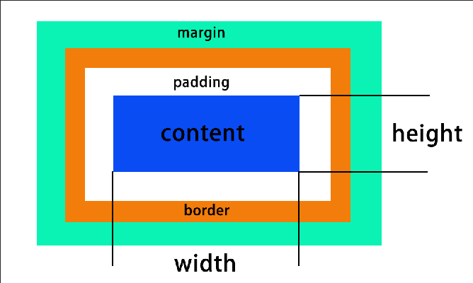
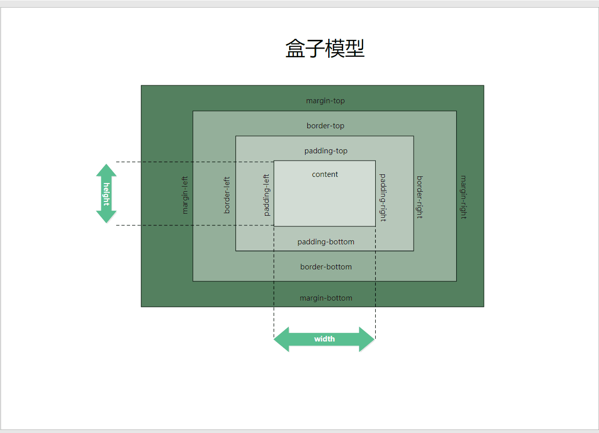

盒子模型，网页布局的功能之一。

CSS 将页面中的所有元素都设置成了一个`矩形的盒子`，对页面的布局就是把这些盒子放在不同的位置上。

 一个盒子包括如下基本部分：

- 内容区 （content）: 元素的所有子元素和文本内容都在内容区中排列
- 内边距（padding）：内容区和边框的距离，四个方向上右下左
- 边框（border）: 盒子的边缘，边框里面是盒子的内部，外面就是外部
- 外边距（margin）：和其他盒子的距离



详细版本：




## 内容区（content）

```html
<!DOCTYPE html>
<html lang="en">

<head>
  <meta charset="UTF-8">
  <meta http-equiv="X-UA-Compatible" content="IE=edge">
  <meta name="viewport" content="width=device-width, initial-scale=1.0">
  <title>盒子模型</title>
  <style>
    .box1 {
      /* 宽高设置的是内容区的宽和高 */
      width: 200px;
      height: 200px;
      background-color: green;
    }

    /* 设置边框，参数分别为宽度，颜色，边框样式 */
    .box1 {
      border-width: 10px;
      border-color: red;
      border-style: solid;
    }

    .box1 {
      border: 10px red solid;
    }
  </style>
</head>

<body>

  <div class="box1">

  </div>

</body>

</html>
```


## 内边距（padding）

 一个盒子的可见大小，由内容区，内边距，边框共同决定。所以计算一个盒子的大小的时候需要将这三个区域一起计算。

示例：

```html
<!DOCTYPE html>
<html lang="en">

<head>
  <meta charset="UTF-8">
  <meta http-equiv="X-UA-Compatible" content="IE=edge">
  <meta name="viewport" content="width=device-width, initial-scale=1.0">
  <title>盒子模型-内边距</title>
  <style>
    .box1 {
      /* 宽高设置的是内容区的宽和高 */
      width: 200px;
      height: 200px;
      background-color: green;
    }

    .inner {
      height: 100px;
      width: 100px;
      background-color: yellow;
    }

    /* 设置内边距 */
    .box1 {
      padding-top: 10px;
      padding-right: 10px;
      padding-bottom: 10px;
      padding-left: 10px;
    }

    /* 缩写形式 上右下左 */
    .box1 {
      padding: 10px, 20px, 30px, 40px;
    }

    /* 上10，左右 20，下 30 */
    .box1 {
      padding: 10px, 20px, 30px;
    }

    /* 上下 10，左右 20 */
    .box1 {
      padding: 10px, 20px;
    }

    /* 上下左右都是 10 */
    .box1 {
      padding: 10px;
    }
  </style>
</head>

<body>

  <div class="box1">
    <div class="inner"></div>
  </div>

</body>

</html>
```


## 外边距（margin）

外边距不会影响盒子的大小，但是会影响盒子的位置。

外边距也有四个方向：上右下左

- 设置左或者上外边距，移动自身
- 设置右或者下外边距，移动其他元素
- 原因：元素在页面上都是从左上到右下排练，设置右和下会移动其他的元素。

> 外边距的简写形式和内边距是一样的。

示例：

```html
<!DOCTYPE html>
<html lang="en">

<head>
  <meta charset="UTF-8">
  <meta http-equiv="X-UA-Compatible" content="IE=edge">
  <meta name="viewport" content="width=device-width, initial-scale=1.0">
  <title>盒子模型-外边距</title>
  <style>
    .box1 {
      /* 宽高设置的是内容区的宽和高 */
      width: 200px;
      height: 200px;
      background-color: green;
      border: 10px red solid;
    }

    .box2 {
      /* 宽高设置的是内容区的宽和高 */
      width: 200px;
      height: 200px;
      background-color: yellow;
      border: 10px red solid;
    }

    /* 
    margin-top:上外边距 正值盒子向下移动 
    margin-left: 左外边距，正值盒子向右移动
    设置 右和下外边距不会动：
      原因：元素在页面上都是子左上到右下排练，设置右和下会移动其他的元素
    */
    .box1 {
      margin-top: 100px;
      margin-left: 100px;
      margin-bottom: 100px;
      margin-right: 100px;
    }
  </style>
</head>
<body>
  <div class="box1"></div>
  <div class="box2"></div>
</body>
</html>
```


## 盒子水平布局

解决的问题就是盒子如何横着摆放 ？

元素在父元素中水平方向的位置由以下几个属性共同决定：从左边—>右边

- margin-left
- border-left
- padding-left
- with
- padding-right
- border-right
- margin-right


!>一个元素在其父元素中，水平布局必须满足以下的等式：↓

!>子元素的：margin-left + border-left + padding-left + with + padding-right + border-right + margin-right = 父元素内容区的宽度 (必须满足)

如果相加结果使等式不成立，就称之为`过度约束`，并且等式会自动调整。

假如我们的父元素宽度为 800px :

- 如果7个值中没有 `auto` , 浏览器会自动调整 `margin-right ` 使等式成立。
  - 例如：0 + 0 + 0 + 200 + 0 + 0 + 0 = 800  会调整为：0 + 0 + 0 + 200 + 0 + 0 + 600 = 800
  - 例如：100 + 0 + 0 + 200 + 0 + 0 + 0 = 800  会调整为：100 + 0 + 0 + 200 + 0 + 0 + 500 = 800
- 这7个值中有3个值可以设置为 auto : with、margin-left、margin-right，如果某个值为 auto 就会自动调整使等式成立
  - 例如：100 + 0 + 0 + auto+ 0 + 0 + 0 = 800  会调整为：100 + 0 + 0 + 700+ 0 + 0 + 0= 800
  - with 的值默认就是 auto 
  - 如果都是 auto 会调整 with 为最大，外边距变成 0
  - 如果宽度固定，两边的边距为 auto , 则会将外边距设置为相同的值。可以利用这个特点将元素在其父元素中居中。

示例：

<details>
<summary> 盒子模型水平布局（点击展开）</summary>

```html
<!DOCTYPE html>
<html lang="en">

<head>
  <meta charset="UTF-8">
  <meta http-equiv="X-UA-Compatible" content="IE=edge">
  <meta name="viewport" content="width=device-width, initial-scale=1.0">
  <title>盒子模型水平布局</title>
  <style>
    .outer {
      width: 800px;
      height: 200px;
      border: 10px red solid;
    }

    .inner {
      /* auto 会自动调整以满足等式 */
      width: auto;
      height: 200px;
      background-color: yellow;
      margin-left: 100px;
    }

    .outer2 {
      width: 800px;
      height: 200px;
      border: 10px red solid;
    }

    /* 宽度固定，左右边距auto 左右边距会平分 */
    .inner2 {
      width: 200px;
      height: 200px;
      margin-left: auto;
      margin-right: auto;
      background-color: yellow;
    }
  </style>
</head>

<body>

  <div class="outer">
    <div class="inner"></div>
  </div>
  <br>
  <br>
  <div class="outer2">
    <div class="inner2"></div>
  </div>

</body>

</html>
```

</details>


## 盒子垂直布局

- 父元素的高度不写的话会被内容撑开。如果指定了高度的话，那么就是指定的高度。
- 子元素在父元素的内容区中排列，如果子元素的高度草超过了父元素，则子元素就会溢出。
  - 父元素通过 `overflow` 来解决溢出的问题。
    - visible ： 默认值，子元素会溢出，在父元素外面位置显示。
    - hidden ： 溢出的内容将会被裁减掉。
    - scroll ：生成滚动条，水平和垂直都有。
    - auto ：根据需要生成滚动条，水平需要就出水平，垂直需要就出垂直的。


示例：

<details>
<summary> 盒子的垂直布局（点击展开）</summary>

```html
<!DOCTYPE html>
<html lang="en">

<head>
  <meta charset="UTF-8">
  <meta http-equiv="X-UA-Compatible" content="IE=edge">
  <meta name="viewport" content="width=device-width, initial-scale=1.0">
  <title>盒子的垂直布局</title>
  <style>
    .outer {
      background-color: yellow;
    }

    .inner {
      background-color: green;
      height: 200px;
      width: 100px;
      margin-bottom: 100px;
    }

    .box1 {
      width: 200px;
      height: 200px;
      background-color: aqua;
      /* overflow: auto; */
    }

    /* 子元素溢出 */
    .box2 {
      width: 100px;
      height: 500px;
      background-color: black;
    }
  </style>
</head>

<body>
  <div class="outer">
    <div class="inner"></div>
    <div class="inner"></div>
  </div>
  <br>
  子元素溢出 ↓
  <div class="box1">
    <div class="box2"></div>
  </div>
</body>

</html>
```

</details>


## 盒子的外边距折叠

垂直外边距的重叠：`相邻的垂直方向，外边距会发生重叠现象。`

- 兄弟元素：兄弟元素之间相邻垂直方向的外边距 ↓ （不需要特殊的处理）
  - 两者都是正值：会取两者之间的较大值。
  - 两者一正一负：取两者之和。
  - 两个都是负：取绝对值较大的那个。
- 父子元素：父子元素之间相邻垂直方向的外边距 
  - 子元素的外边距会传递给父元素（上外边距）。
  - 父子外边距的折叠会影响页面的布局，需要处理。

示例：

<details>
<summary> 盒子的外边距折叠（点击展开）</summary>

```html
<!DOCTYPE html>
<html lang="en">

<head>
  <meta charset="UTF-8">
  <meta http-equiv="X-UA-Compatible" content="IE=edge">
  <meta name="viewport" content="width=device-width, initial-scale=1.0">
  <title>盒子的外边距折叠</title>
  <style>
    .box1 {
      width: 200px;
      height: 200px;
      background-color: aqua;
      /* 下外边距 */
      margin-bottom: 100px;
    }

    .box2 {
      width: 200px;
      height: 200px;
      background-color: black;
      /* 上外边距 */
      margin-top: 100px;
    }

    .box3 {
      width: 500px;
      height: 500px;
      background-color: green;
      /* border: 1px orange solid; */
    }

    .box4 {
      width: 250px;
      height: 250px;
      background-color: yellow;
      margin-top: 250px;
    }
  </style>
</head>

<body>
  <!-- <div class="box1"></div>
  <div class="box2"></div> -->

  <div class="box3">
    <div class="box4"></div>
  </div>
</body>

</html>
```

</details>