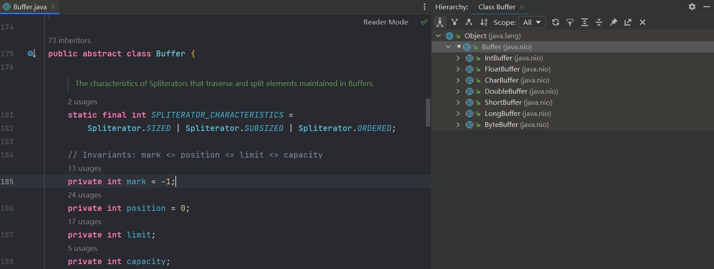

BIO && NIO 的区别示意图：


NIO 相关的类都在java.nio包及子包下，对原java.io包中的很多类进行了优化

NIO有三个核心的部分：Channel (通道) ,Buffer (缓冲区) ,Selector (选择器) 

他们的关系：

- NIO是可以一个线程处理多个客户端，不像BIO一个客户端就需要一个线程去处理。

- 每个Channel都对应一个Buffer，Selector对应一个线程，一个线程对应多个Channel

- Selector会根据不同的事件在不同的Channel进行切换
- 数据的读写通过Buffer,与BIO不同的是，Buffer的读写是双向的，通过flip方法切换
- Channel是双向的，可以返回操作系统的情况


## 缓冲区（Buffer）

缓存区本质是一个可以读写数据的内存块，可以看成是一个容器对象，它提供了一组方法去使用这个内存块。（通过源码可以看到Buffer的子类中都维护了一个数组 `final byte[] hb; ` 来处理数据）除了boolean以外的其他基本数据类型都有对应的Bufffer子类,例如IntBuffer等。



Buffer提供了主要的几个参数：

| 属性     | 说明                                                         |
| -------- | ------------------------------------------------------------ |
| mark     | 标记。                                                       |
| position | 位置，表示下一次需要写或者读取的元素的位置索引。每次读写都会修改这个值以便下次读写使用。 |
| limit    | 表示Buffer的边界，数据的读写不能超过边界。                   |
| capacity | 容量，缓存区创建的时候指定并且不能改变。                     |

### 演示下 IntBuffer

```java
/**
 * Buffer演示
 */
public class Test {
    public static void main(String[] args) {
        IntBuffer intBuffer = IntBuffer.allocate(5);
        // 顺序写入数据
        for (int i = 0; i < intBuffer.capacity(); i++) {
            intBuffer.put(i * 2);
        }
        // 写变成读
        intBuffer.flip();
        // 可以指定从哪里开始读,不指定从开始位置开始读
        intBuffer.position(2);
        // 指定边界，0,2,4,6,8。指定边界为3那么只能读取到0,2,4三个数据
        intBuffer.limit(3);
        // 顺序读取数据
        while (intBuffer.hasRemaining()) {
            System.out.println(intBuffer.get());
        }
    }
}
```


### 只读Buffer

```java
/**
 * 只读Buffer
 */
public class Test {
    public static void main(String[] args) {
        ByteBuffer byteBuffer = ByteBuffer.allocate(10);
        for (int i = 0; i < byteBuffer.capacity() - 1; i++) {
            byteBuffer.put((byte) i);
        }
        byteBuffer.flip();
        // 只读buffer
        ByteBuffer readOnlyBuffer = byteBuffer.asReadOnlyBuffer();
        // readOnlyBuffer.put((byte) 1); Exception in thread "main" java.nio.ReadOnlyBufferException
        while (readOnlyBuffer.hasRemaining()) {
            System.out.println(readOnlyBuffer.get());
        }
    }
}
```


### MappedByteBuffer

MappedByteBuffer 可以让文件在直接在内存中（堆外内存）进行修改，而同步到文件由NIO来完成。其实现类如下：


演示下：

```java
/**
 * MappedByteBuffer
 */
public class Test {
    public static void main(String[] args) throws Exception {
        RandomAccessFile randomAccessFile = new RandomAccessFile("h.txt", "rw");
        FileChannel channel = randomAccessFile.getChannel();

        // 读写模式，从起始位置开始读取6个字节，到内存中。也就是说可以读写的范围是：0~6
        MappedByteBuffer mappedByteBuffer = channel.map(FileChannel.MapMode.READ_WRITE, 0, 6);

        // 修改
        mappedByteBuffer.put(0, (byte) '1');
        mappedByteBuffer.put(4, (byte) 'H');
        // mappedByteBuffer.put("文字".getBytes(StandardCharsets.UTF_8), 0, 6);

        randomAccessFile.close();
        channel.close();
    }
}
```


### Scattering && Gathering

NIO 支持多个 Buffer 也就是 Buffer 数组来完成读写操作。

Scattering 将数据写入到 Buffer 时候可以采用 Buffer数组依次写入（一个Buffer 满了继续写入下一个 Buffer）。

Gathering 从 Buffer 读取数据的时候可以采用 Buffer 数组，依次读数组中的每个 Buffer。

```java
public class Test {
    public static void main(String[] args) throws Exception {
        ServerSocketChannel serverSocketChannel = ServerSocketChannel.open();
        serverSocketChannel.socket().bind(new InetSocketAddress(6000));

        ByteBuffer[] byteBuffers = new ByteBuffer[2];
        byteBuffers[0] = ByteBuffer.allocate(5);
        byteBuffers[1] = ByteBuffer.allocate(3);

        SocketChannel socketChannel = serverSocketChannel.accept();
        long messageLimit = 8;
        while (true) {
            int totalRead = 0;
            while (totalRead < messageLimit) {
                long read = socketChannel.read(byteBuffers);
                totalRead += read;
                System.out.println("读取的字节数：" + totalRead);
                Arrays.stream(byteBuffers)
                        .map(byteBuffer -> byteBuffer.position() + "," + byteBuffer.limit() + " ").forEach(System.out::print);
            }
            // flip
            Arrays.stream(byteBuffers).forEach(Buffer::flip);
            // 读取数据
            long totalWrite = 0;
            while (totalWrite < messageLimit) {
                long write = socketChannel.write(byteBuffers);
                totalWrite += write;
            }
            // clear
            Arrays.stream(byteBuffers).forEach(Buffer::clear);

            System.out.println("totalRead:" + totalRead + ", totalWrite:" + totalWrite + ",");
        }
    }
}
```


## 通道（Channel）

NIO Channel

- 可以同时进行读写，而流只能读或者写
- 可以实现异步读写数据
- 可以从 Buffer 中读取数据，也可以写数据到 Buffer


Channel是一个接口定义 `public interface Channel extends Closeable`，常用的Channel类：

- FileChannel   用于文件的读写
- DatagramChannel   用于 UDP 的数据读写

- ServerSocketChannel 、SocketChannel  用于 TCP 数据的读写


FileChannel写文件的测试代码：


```java
public class NIOChannelFile {
    public static void main(String[] args) throws Exception {
        String msg = "hello world";
        FileOutputStream fileOutputStream =
                new FileOutputStream("/Users/lichenghao/Desktop/hello.txt");
        // 得到对应的Channel通道
        FileChannel channel = fileOutputStream.getChannel();
        // 得到Buffer
        ByteBuffer byteBuffer = ByteBuffer.allocate(1024);
        // Buffer读取数据
        byteBuffer.put(msg.getBytes("UTF-8"));
        // Buffer 由读变成写,写入到Channel
        byteBuffer.flip();
        channel.write(byteBuffer);
        // 关闭流
        fileOutputStream.close();
    }
}
```

有了写文件的代码，读取文件就很简单了，反过来即可：

```java
public class NIOChannelReadFile {
    public static void main(String[] args) throws Exception {
        FileInputStream fileInputStream =
                new FileInputStream(new File("/Users/lichenghao/Desktop/hello.txt"));
        FileChannel channel = fileInputStream.getChannel();
        ByteBuffer byteBuffer = ByteBuffer.allocate(1024);
        channel.read(byteBuffer);
        System.out.println(new String(byteBuffer.array()));
        fileInputStream.close();
    }
}
```


## 选择器（Selector）

Selector能够检测多个注册的通道上是否有事件发生。多个Channel可以注册在一个Selector上。如果有事件发生，就能获取到事件，然后对这个事件进行处理。这样就可以通过一个线程去管理多个通道，管理多个连接和请求。

Selector是个抽象类`public abstract class Selector implements Closeable {...}`  其主要有如下的方法：

```java
{
    protected Selector() { }

   	// 获得一个新的选择器对象
    public static Selector open() throws IOException {
        return SelectorProvider.provider().openSelector();
    }

    public abstract boolean isOpen();

    // 选择器的提供者
    public abstract SelectorProvider provider();

   	// 返回有事件发生的SelectionKey的集合
    public abstract Set<SelectionKey> selectedKeys();

    // 监控注册的通道，获取监控的事件，将对应的SelectionKey加入到内部集合中，timeout为超时时间。
    public abstract int select(long timeout)
        throws IOException;

  	// 监控注册的通道，获取监控的事件，将对应的SelectionKey加入到内部集合中，阻塞的方法
    public abstract int select() throws IOException;

   	// 唤醒Selector
    public abstract Selector wakeup();
	
    ...
}
```

演示下 Selector

接收端

```java
/**
 * 演示Selector
 */
public class NIOServer {
    public static void main(String[] args) throws IOException {

        // 选择器
        Selector selector = Selector.open();
        // ServerSocketChannel
        ServerSocketChannel serverSocketChannel = ServerSocketChannel.open();
        // 监听端口
        serverSocketChannel.socket().bind(new InetSocketAddress(7777));
        // 通道非阻塞
        serverSocketChannel.configureBlocking(false);
        // 注册到selector，注册的事件为OP_ACCEPT
        serverSocketChannel.register(selector, SelectionKey.OP_ACCEPT);

        while (true) {
            if (selector.select(1000) == 0) {
                // 通道上没有事件发生
                System.out.println("无连接！");
            } else {
                // 获取到有事件发生的相关的SelectionKey集合
                Set<SelectionKey> selectionKeys = selector.selectedKeys();
                Iterator<SelectionKey> iterator = selectionKeys.iterator();
                while (iterator.hasNext()) {
                    SelectionKey selectionKey = iterator.next();
                    if (selectionKey.isAcceptable()) {
                        // 有客户端链接，给他生成一个socketChannel
                        SocketChannel socketChannel = serverSocketChannel.accept();
                        // 设置通道非阻塞
                        socketChannel.configureBlocking(false);
                        // 将改channel绑定buffer并且注册到选择器上
                        socketChannel.register(selector, SelectionKey.OP_READ, ByteBuffer.allocate(100));
                        System.out.println("客户端连接成功：" + socketChannel.hashCode());
                    }
                    // 连接成功后，就可以读取数据了
                    if (selectionKey.isReadable()) {
                        SocketChannel socketChannel = (SocketChannel) selectionKey.channel();
                        ByteBuffer byteBuffer = (ByteBuffer) selectionKey.attachment();
                        socketChannel.read(byteBuffer);
                        System.out.println("客户端：" + new String(byteBuffer.array()));
                    }
                    // 操作完毕后，移除
                    iterator.remove();
                }
            }
        }
    }
}
```

客户端

```java
/**
 * 演示Selector
 */
public class NIOClient {
    public static void main(String[] args) throws IOException {
        SocketChannel socketChannel = SocketChannel.open();
        // 通道非阻塞
        socketChannel.configureBlocking(false);
        // 连接服务地址
        InetSocketAddress inetSocketAddress = new InetSocketAddress("127.0.0.1", 7777);
        // 建立连接
        if (!socketChannel.connect(inetSocketAddress)) {
            while (!socketChannel.finishConnect()) {
                System.out.println("连接中...");
            }
        }
        String msg = "hello world!";
        ByteBuffer wrap = ByteBuffer.wrap(msg.getBytes(StandardCharsets.UTF_8));
        // 发送数据
        socketChannel.write(wrap);
        System.in.read();
    }
}
```


## NIO程序示例

### NIO Server - Client  

代码示例：

```java
/**
 * 服务端
 */
public class Server {
    public static void main(String[] args) throws IOException {
        // 得到一个ServerSocketChannel服务端通道
        ServerSocketChannel serverSocketChannel = ServerSocketChannel.open();
        // 设置通道异步
        serverSocketChannel.configureBlocking(false);
        // 监听端口
        serverSocketChannel.socket().bind(new InetSocketAddress(6666));
        // 注册到Selector上，注册类型有四种：OP_ACCEPT:有新的网络可连接；OP_CONNECT:已经建立连接；OP_READ:读操作；OP_WRITE:写操作
        Selector selector = Selector.open();
        serverSocketChannel.register(selector, SelectionKey.OP_ACCEPT);
        // 监听通道上是否有事件发生
        while (selector.select() > 0) {
            Set<SelectionKey> selectionKeys = selector.selectedKeys();
            if (selectionKeys != null && !selectionKeys.isEmpty()) {
                Iterator<SelectionKey> iterator = selectionKeys.iterator();
                while (iterator.hasNext()) {
                    SelectionKey selectionKey = iterator.next();
                    if (selectionKey.isAcceptable()) {
                        // 连接请求,为客户端生成一个socketChannel
                        SocketChannel socketChannel = serverSocketChannel.accept();
                        // 设置非阻塞
                        socketChannel.configureBlocking(false);
                        // 客户端注册到Selector上
                        socketChannel.register(selector, SelectionKey.OP_READ, ByteBuffer.allocate(1024));
                    }
                    if (selectionKey.isReadable()) {
                        SocketChannel channel = (SocketChannel) selectionKey.channel();
                        ByteBuffer byteBuffer = (ByteBuffer) selectionKey.attachment();
                        channel.read(byteBuffer);
                        System.out.println("Client:" + new String(byteBuffer.array()));
                    }
                    // 处理完毕的清除掉
                    iterator.remove();
                }
            }
        }
    }
}
```

```java
/**
 * 客户端
 */
public class Client {
    public static void main(String[] args) throws IOException {
        // 客户端通道
        SocketChannel socketChannel = SocketChannel.open();
        // 设置非阻塞
        socketChannel.configureBlocking(false);
        // 绑定服务
        InetSocketAddress socketAddress = new InetSocketAddress("127.0.0.1", 6666);
        // 连接中
        if (!socketChannel.connect(socketAddress)) {
            while (!socketChannel.finishConnect()) {
                System.out.println("连接中...");
            }
        }
        // 连接成功后
        ByteBuffer wrap = ByteBuffer.wrap("hello Server".getBytes());
        // 发送消息给服务
        socketChannel.write(wrap);
    }
}

```

说明如下：

- 当客户端链接的时候，通过ServerSocketChannel 得到SocketChannel,并将该SocketChannel注册到Selector上

,返回一个SelectionKey与之对应。

- Selector 监控着select方法，如果通道上有对应的事件发生，就会返回对应的通道以及能获取到SelectionKey。
- 通过SelectionKey就可以得到对应的SokcetChannel来完业务操作。


### NIO  群聊系统

服务端

```java
public class ChatServer {

    private Selector selector;
    private ServerSocketChannel serverSocketChannel;
    private static final int port = 6666;

    public ChatServer() throws IOException {
        serverSocketChannel = serverSocketChannel.open();
        serverSocketChannel.configureBlocking(false);
        selector = Selector.open();
        serverSocketChannel.socket().bind(new InetSocketAddress(port));
        serverSocketChannel.register(selector, SelectionKey.OP_ACCEPT);
    }

    public void listen() throws IOException {
        while (true) {
            if (selector.select(2000) > 0) {
                Set<SelectionKey> selectionKeys = selector.selectedKeys();
                Iterator<SelectionKey> iterator = selectionKeys.iterator();
                while (iterator.hasNext()) {
                    SelectionKey selectionKey = iterator.next();
                    // 客户端连接
                    if (selectionKey.isAcceptable()) {
                        SocketChannel socketChannel = serverSocketChannel.accept();
                        socketChannel.configureBlocking(false);
                        socketChannel.register(selector, SelectionKey.OP_READ);
                        System.out.println(socketChannel.getRemoteAddress() + "-上线！");
                    }
                    // 读取客户端的信息
                    if (selectionKey.isReadable()) {
                        clientMsg(selectionKey);
                    }
                    iterator.remove();
                }
            }
        }
    }

    /**
     * 读取客户端发送的消息
     *
     * @param selectionKey 客户端channel对应的selectionKey
     */
    private void clientMsg(SelectionKey selectionKey) {
        SocketChannel channel = null;
        ByteBuffer byteBuffer = ByteBuffer.allocate(1024);
        int read = 0;
        try {
            channel = (SocketChannel) selectionKey.channel();
            read = channel.read(byteBuffer);
            if (read > 0) {
                String msg = new String(byteBuffer.array());
                System.out.println(channel.getRemoteAddress() + "-说：" + msg);
                // 转发消息给其他客户端
                sendMsgToOthers(msg, channel);
            } else {
                System.out.println(channel.getRemoteAddress() + "-下线！");
                selectionKey.cancel();
                channel.close();
            }
        } catch (IOException e) {
            try {
                selectionKey.cancel();
                channel.close();
            } catch (IOException ioException) {
                ioException.printStackTrace();
            }
        }
    }

    /**
     * 消费发送给其他客户端
     *
     * @param msg  消息内容
     * @param self 发送消息的channel，用来排除发送消息的客户端
     * @throws IOException
     */
    private void sendMsgToOthers(String msg, SocketChannel self) throws IOException {
        for (SelectionKey selectionKey : selector.keys()) {
            SelectableChannel channel = selectionKey.channel();
            if (channel instanceof SocketChannel && channel != self) {
                SocketChannel target = (SocketChannel) channel;
                ByteBuffer wrap = ByteBuffer.wrap(msg.getBytes());
                target.write(wrap);
            }
        }
    }


    public static void main(String[] args) throws IOException {
        // 启动服务端
        ChatServer chatServer = new ChatServer();
        // 监听消息
        chatServer.listen();
    }
}
```

客户端

```java

public class ChatClient {

    private static final String HOST = "127.0.0.1";
    private static final int PORT = 6666;
    private SocketChannel socketChannel;
    private Selector selector;
    private String currentIp;

    public ChatClient() throws IOException {
        selector = selector.open();
        socketChannel = socketChannel.open(new InetSocketAddress(HOST, PORT));
        socketChannel.configureBlocking(false);
        socketChannel.register(selector, SelectionKey.OP_READ);
        currentIp = socketChannel.getLocalAddress().toString();
    }

    /**
     * 发送消息
     *
     * @param msg 消息内容
     */
    private void chat(String msg) {
        String toMsg = currentIp + "-say:" + msg;
        try {
            socketChannel.write(ByteBuffer.wrap(toMsg.getBytes()));
        } catch (IOException e) {
            e.printStackTrace();
        }
    }

    /**
     * 获取其他人的消息
     *
     * @throws IOException
     */
    private void getMsg() throws IOException {
        int select = selector.select();
        if (select > 0) {
            Set<SelectionKey> selectionKeys = selector.selectedKeys();
            Iterator<SelectionKey> iterator = selectionKeys.iterator();
            while (iterator.hasNext()) {
                SelectionKey se = iterator.next();
                if (se.isReadable()) {
                    SocketChannel channel = (SocketChannel) se.channel();
                    ByteBuffer buffer = ByteBuffer.allocate(1024);
                    channel.read(buffer);
                    System.out.println(new String(buffer.array()));
                }
                iterator.remove();
            }
        }
    }

    public static void main(String[] args) throws IOException {
        // 启动客户端
        ChatClient chatClient = new ChatClient();
        // 读取他人的消息
        new Thread(() -> {
            while (true) {
                try {
                    chatClient.getMsg();
                } catch (IOException e) {
                    e.printStackTrace();
                }
            }
        }).start();
        // 发送消息
        Scanner scanner = new Scanner(System.in);
        while (scanner.hasNextLine()) {
            String msg = scanner.nextLine();
            chatClient.chat(msg);
        }
    }
}

```


## 零拷贝（Zero-Copy）

参考文档：

- https://www.jianshu.com/p/12601d5135b6
- https://www.bilibili.com/read/cv16415171
- https://developer.ibm.com/articles/j-zerocopy/


零拷贝在NIO中使用极多。JAVA中常用的零拷贝有两种模式 `mmp(内存映射)`和 `sendFile`。

### 传统 IO

首先了解下一次传统 IO 的过程。


整个过程解读：

1. 用户发起读取或者拷贝的请求，这个请求由CPU来处理完成，用户态陷入内核态 。

2. CPU向磁盘发起I/O请求，磁盘收到之后开始准备数据。

3. 磁盘将数据放到磁盘缓冲区之后，向CPU发起I/O中断，报告CPU数据已经准备好了。

4. CPU收到磁盘控制器的I/O中断信号之后，开始拷贝数据，完成之后read()返回，再从内核态切换到用户态。

整个过程用户是阻塞状态，同时CPU也不能去干其他事情，直到整个过程完毕。（可以看出CPU在这干拷贝太浪费了）


### DMA( Direct Memory Access )

为了解决传统 IO 下 CPU 资源浪费的问题，大神们提出了DMA，直接内存访问（Direct Memory Access）技术。（是一种硬件设备绕开CPU独立直接访问内存的机制 ）。

那么加入了DMA后，一次 IO 的过程如下所示：


与传统IO不同的是，CPU收到请求后，进一步将 I/O 请求发送 DMA，然后 CPU 执行其他任务；CPU 收到 DMA 的信号，知道数据已经准备好，于是将数据从内核拷贝到用户空间，系统调用返回。这样大大提高的CPU的使用率。

其中支持DMA硬件有：


那么我们有了DMA技术后，再来看一下如果发送一个文件出去的过程，我们通过代码先read文件，然利用socket发送出去：


我们只是读取一个文件然后发送出去，这期间发生了4次拷贝操作，两次DMA拷贝，两次CPU拷贝。还涉及到4次的CPU的切换。这只是一次简单的操作，还有这么多的操作。如果是在高并发的系统下，这样频繁的切换和拷贝定会影响性能。那么优化的点就在于减少CPU上下文的切换和减少拷贝操作，所以零拷贝出现了。

### mmap + write


mmap() 系统调用函数会直接把内核缓冲区中的数据映射到用户空间中，那么内核和用户之间就不用进行数据的拷贝了。

整个过程：

- 用户发送读取的请求，调用mmap()后，DMA会把磁盘的数据拷贝到内核的缓冲区中，然后用户和内核共享这块缓冲区。
- 用户在发送写入请求，操作系统直接将内核缓冲区中的数据拷贝到 socket 缓冲区中。
- 最后内核 socket 缓冲的数据通过 DMA 拷贝拷贝到网卡缓冲中，发送出去。

可以看出，系统调用还是发生了2次，CPU还是参与了拷贝了事情。

### sendfile

后来在Linux 内核版本 2.1及以后，提供了一个专门发送文件的系统调用函数`sendfile()`。用了这个函数后，我们的操作变成了：


通过 sendfile 替换了用户的读取和写入的系统调用。同样可以将内核缓冲的数据直接拷贝到 socket 缓冲。这样就1一次系统调用，2次上下文切换，3次拷贝。但是CPU仍然参与了拷贝。

### zero-copy

如果网卡支持 SG-DMA（*The Scatter-Gather Direct Memory Access*）技术（和普通的 DMA 有所不同），我们可以进一步减少通过 CPU 把内核缓冲区里的数据拷贝到 socket 缓冲区的过程。如下所示：


它的过程：

- DMA 将磁盘上的数据拷贝到内核缓冲区里。

- 缓冲区描述符和数据长度传到 socket 缓冲区，这样网卡的 SG-DMA 控制器就可以直接将内核缓存中的数据拷贝到网卡的缓冲区里。

可以看到CPU不再参与数据的拷贝，这才是真正的`零拷贝`。

下面是零拷贝的性能测试截图：


