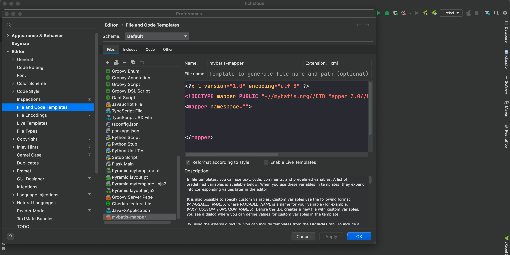

IntelliJ IDEA 的每个方面都旨在最大化开发者生产力。结合智能编码辅助与符合人体工程学的设计，让开发不仅高效，更成为一种享受。

官网：https://www.jetbrains.com.cn/idea/

## mapper文件模板

可以通过各种代码生成器和插件来生成 mapper.xml 文件。但是有时候想自己新建个文件又记不住文件头，那么可以自定义个文件模板。

依次进入：

Preferences | Editor | File and Code Templates   



新建个模板，名称随便，扩展名填写 xml 

模板内填入内容

```xml
<?xml version="1.0" encoding="utf-8" ?>
<!DOCTYPE mapper PUBLIC "-//mybatis.org//DTD Mapper 3.0//EN" "http://mybatis.org/dtd/mybatis-3-mapper.dtd" >
<mapper namespace="">
    
    
</mapper>
```

然后在新建的时候就可以用这个模板了。

