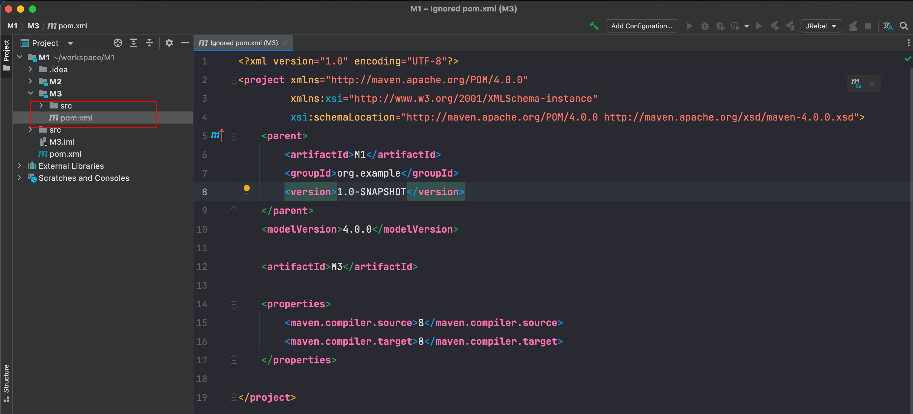
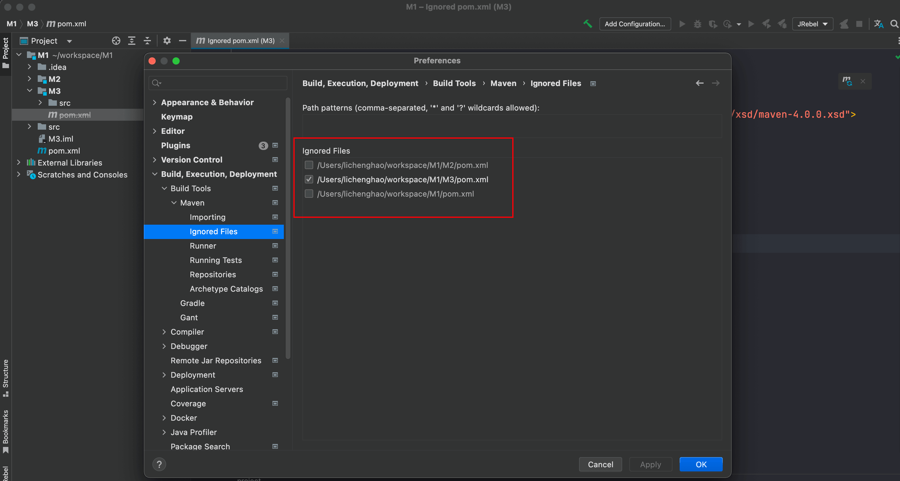

## POM文件灰色带横线

Maven聚合工程中的一个子模块中的pom文件灰色带删除横线，如下所示：

出现问题的原因：如果你删除了这个模块，然后又新增了相同名称的模块，那么这个 POM文件就会自动加入到 Ignored Files 中。（Mac下新增 Moudule的时候会提示你模块存在，其实你已经删除了，这个时候需要在父POM中删除该模块才能继续添加）

解决就好办了，在 Ignored Files 中取消勾选即可。（删除项目然后新建同样的聚合项目，也会有这个问题）。

