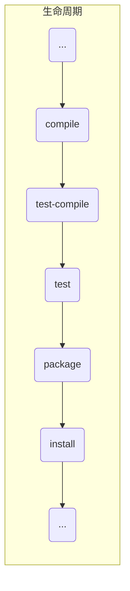

你对 Maven 真的不能在熟悉了，可能用了不止几年了，梳理过 Maven的知识吗？[maven项目管理从基础到高级](https://www.bilibili.com/video/BV1Ah411S7ZE)

## 简介

Maven本质是一个项目管理工具，将项目开发和管理过程抽象成一个项目对象模型POM（ProjectObjectModel）。


作用：

- 项目构建：提供标准的，跨平台的自动化项目构建方式

- 依赖管理：管理项目依赖的jar,避免冲突等

- 开发目录结构：提供标准统一的项目结构


## 下载安装

安装很简单，网上有很多教程，例如：

[菜鸟教程-Maven 环境配置](https://www.runoob.com/maven/maven-setup.html)

[Mac OS X下Maven的安装与配置](https://www.jianshu.com/p/191685a33786)

## 概念

**仓库**

仓库用于存储各种 jar 包。

分类：

- 本地仓库：本地用于存储资源的仓库，并且连接远程仓库获取资源。
- 远程仓库：为本地仓库提供资源的仓库。
  - 中央仓库：Maven 团队维护，提供所有资源的仓库。
  - 私服：比如公司内部会建个私服，内部员工使用，可以从远程仓库获取资源。
  - 镜像仓库：例如[阿里Maven仓库](https://developer.aliyun.com/mvn/guide),[网易Maven仓库](http://mirrors.163.com/maven/repository/maven-central/)。


**坐标**

有了仓库后，如何找对应的资源？就用到了坐标。坐标用于描述资源在仓库中的位置。

组成？

::: info Maven坐标的组成部分

groupld∶定义当前Maven项目隶属组织名称

artifactId∶定义当前Maven项目名称

version∶定义当前项目版本号

:::

例如：google的guava工具包。

```xml
<!-- https://mvnrepository.com/artifact/com.google.guava/guava -->
<dependency>
    <groupId>com.google.guava</groupId>
    <artifactId>guava</artifactId>
    <version>30.0-jre</version>
</dependency>
```

## 仓库配置

**本地仓库配置**

Maven安装完毕后，仓库的默认位置为当前用户下的.m2文件夹下

```xml
<localRepository>${user.home}/.m2/repository</localRepository>
```

这个路径可以修改自定义路径如下所示：

```xml
<!-- localRepository
   | The path to the local repository maven will use to store artifacts.
   |
   | Default: ${user.home}/.m2/repository
  <localRepository>/path/to/local/repo</localRepository>
  -->
  <localRepository>/Users/lichenghao/tools/localRepo</localRepository>
```

镜像仓库

默认的远程仓库都是国外的，访问很慢，所以我们可以用国内大厂提供的镜像仓库

```xml
</mirrors> 
		<mirror>
      <!-- 用来区分不同的mirror-->
      <id>alimaven</id>
      <!-- 替换哪个仓库 -->
      <mirrorOf>central</mirrorOf>
      <!-- 仓库名称 -->
      <name>aliyun maven</name>
      <!-- 仓库地址 -->
      <url>http://maven.aliyun.com/nexus/content/groups/public/</url>
     </mirror>
  </mirrors>
```

其他镜像仓库地址：

华为云：

```xml
<mirror>
　　<id>huaweicloud</id>
   <name>华为云 maven</name>
   <mirrorOf>*</mirrorOf>
   <url>https://mirrors.huaweicloud.com/repository/maven/</url>
</mirror>
```

腾讯云：

```xml
<mirror>
　　<id>nexus-tencentyun</id>
　　<mirrorOf>*</mirrorOf>
　　<name>Nexus tencentyun</name>
　　<url>http://mirrors.cloud.tencent.com/nexus/repository/maven-public/</url>
</mirror>
```

163

```xml
<mirror>
  <id>nexus-163</id>
  <mirrorOf>*</mirrorOf>
  <name>Nexus 163</name>
  <url>http://mirrors.163.com/maven/repository/maven-public/</url>
</mirror>
```

## 创建项目

通常我们通过开发工具创建 Maven 项目，其实也是调用 Maven 的命令通过 Maven 插件去构建。常见的构建命令：

| 命令        | 说明            |
| ----------- | --------------- |
| mvn compile | #编译           |
| mvn clean   | #清理           |
| mvn test    | #测试           |
| mvn package | #打包           |
| mvn install | #安装到本地仓库 |

利用插件构建web工程

```bash
mvn archetype:generate -DgroupId=cn.com.chenghaoli -DartifactId=web-test -DarchetypeArtifactId=maven-archetype-webapp -Dversion=0.0.1-snapshot -DinteractiveMode=false
```

## 依赖管理


**依赖配置**

在dependencies标签下配置多个dependency即可。

```xml
<dependencies>
        <dependency>
            <groupId>junit</groupId>
            <artifactId>junit</artifactId>
            <version>4.13</version>
        </dependency>
        <dependency>
            <groupId>log4j</groupId>
            <artifactId>log4j</artifactId>
            <version>1.2.17</version>
        </dependency>
</dependencies>
```

**依赖传递**

- 直接依赖：通过依赖配置建立的依赖关系。
- 间接依赖：被依赖的资源又依赖了其他资源，那么当前项目间接依赖其他资源。

**依赖传递冲突**

因为依赖具有传递性，所以依赖之间会有冲突，那么解决冲突的方式？

- 路径优先：依赖中出现相同的资源，层级越深优先级越低，层级越浅优先级越高。
- 声明优先：当资源在同一个层级上，声明靠前的覆盖声明靠后的。
- 其他：同级相同资源的不同版本，后配置的覆盖先配置的。

**可选依赖**

如果你不想让引用你的项目知道你是使用了哪个依赖，可以使用 optional 应依赖隐藏。

```xml
 <dependency>
            <groupId>junit</groupId>
            <artifactId>junit</artifactId>
            <version>4.13</version>
            <optional>true</optional>
        </dependency>
```

**排除依赖**

在配置依赖的过程中，可以把依赖中的间接依赖给排除掉，可以避免依赖的冲突。

```xml
<dependency>
            <groupId>org.slf4j</groupId>
            <artifactId>slf4j-log4j12</artifactId>
            <version>1.7.25</version>
            <exclusions>
                <exclusion>
                    <artifactId>slf4j-api</artifactId>
                    <groupId>org.slf4j</groupId>
                </exclusion>
            </exclusions>
        </dependency>
```

**依赖范围**

依赖的 jar 资源可以被用在任何地方，可以通过scope 标签设置其作用范围

| 作用范围类型 | 主代码 | 测试代码 | 打包 | 备注        |
| ------------ | ------ | -------- | ---- | ----------- |
| compile      | √      | √        | √    | Log4j       |
| test         |        | √        |      | Junit       |
| provided     | √      | √        |      | servlet-api |
| runtime      |        |          | √    | jdbc        |

如果依赖设置了作用范围，那么依赖的传递范围将会发生改变。

| 间接依赖↓\直接依赖→ | compile | test | provided | runtime |
| ------------------- | ------- | ---- | -------- | ------- |
| compile             | compile | test | provided | runtime |
| test                |         |      |          |         |
| provided            |         |      |          |         |
| runtime             | runtime | test | provided | runtime |


## 生命周期

Maven生命周期描述的是一次项目构建过程经历了多少事件：




Maven对项目的声明周期管理可以分成三个阶段：

- Clean：清理工作
- Default：核心工作，例如编译打包测试发布
- Site：产生文档，部署等


生命周期的每个节点都有好多事情要做：

**Clean:**

- pre-clean 执行一些需要在clean之前完成的工作

- clean 移除所有上一次构建生成的文件

- post-clean 执行一些需要在clean之后立刻完成的工作


**Default:**

- validate（校验） 校验项目是否正确并且所有必要的信息可以完成项目的构建过程。

- initialize（初始化） 初始化构建状态，比如设置属性值。

- generate-sources（生成源代码） 生成包含在编译阶段中的任何源代码。

- process-sources（处理源代码） 处理源代码，比如说，过滤任意值。

- generate-resources（生成资源文件） 生成将会包含在项目包中的资源文件。

- process-resources （处理资源文件） 复制和处理资源到目标目录，为打包阶段最好准备。

-  ==compile （编译） 编译项目的源代码==

- process-classes（处理类文件） 处理编译生成的文件，比如说对Java class文件做字节码改善优化。

- generate-test-sources（生成测试源代码） 生成包含在编译阶段中的任何测试源代码。

- process-test-sources（处理测试源代码） 处理测试源代码，比如说，过滤任意值。

- generate-test-resources（生成测试资源文件） 为测试创建资源文件。

- process-test-resources（处理测试资源文件） 复制和处理测试资源到目标目录。

- ==test-compile（编译测试源码） 编译测试源代码到测试目标目录。==

- process-test-classes（处理测试类文件） 处理测试源码编译生成的文件。

- ==test（测试） 使用合适的单元测试框架运行测试（Juint是其中之一）。==

- prepare-package（准备打包） 在实际打包之前，执行任何的必要的操作为打包做准备。

- ==package（打包） 将编译后的代码打包成可分发格式的文件，比如JAR、WAR或者EAR文件。==

- pre-integration-test（集成测试前） 在执行集成测试前进行必要的动作。比如说，搭建需要的环境。

- integration-test（集成测试） 处理和部署项目到可以运行集成测试环境中。

- post-integration-test（集成测试后） 在执行集成测试完成后进行必要的动作。比如说，清理集成测试环境。

- verify （验证） 运行任意的检查来验证项目包有效且达到质量标准。

- ==install（安装） 安装项目包到本地仓库，这样项目包可以用作其他本地项目的依赖。==

- deploy（部署） 将最终的项目包复制到远程仓库中与其他开发者和项目共享。


**Site:**

- pre-site 执行一些需要在生成站点文档之前完成的工作

- site 生成项目的站点文档

- post-site 执行一些需要在生成站点文档之后完成的工作，并且为部署做准备

- site-deploy 将生成的站点文档部署到特定的服务器上


## 插件

- 插件与生命周期内的阶段绑定，在执行到对应生命周期时执行对应的插件功能

- 默认maven在各个生命周期上绑定有预设的功能

- 通过插件可以自定义其他功能，例如接口文档生成工具 [smart-doc](https://gitee.com/smart-doc-team/smart-doc)

## ----------

## 聚合&继承

**聚合**

- 创建一个空模块，打包类型定义为pom


```xml
<packaging>pom</packaging>
```

- 定义当前模块进行构建操作时关联的其他模块名称


```xml
<modules>
  <module>../ssm controller</module>
  <module>../ssm service</module>
  <module>../ssm dao</module>
  <module>../ssm_pojo</module>
</modules>
```

- 注意事项∶ 参与聚合操作的模块最终执行顺序与模块间的依赖关系有关，与配置顺序无关。

**继承**

通过继承可以实现在子工程中沿用父工程中的配置。
maven中的继承与java中的继承相似，在子工程中配置继承关系。

在子工程中声明其父工程坐标与对应的位置。

```xml
<!--定义该工程的父工程-->
<parent>
  <groupId>com.google</grouprd>
  <artifactId>ssm</artifactId>
  <version>1.0-SNAPSHOT</version>
  <!--填写父工程的pom文件-->
  <relativePath>../ssm/pom.xml</relativePath>
</parent>
```

除此之外，可以在父类同一配置版本依赖，然后子类使用即可。

```xml
<!--声明此处进行依赖管理-->
<dependencyManagement>
  <!--具体的依赖-->
  <dependencies>
    <!--spring环境-->
    <dependency>
      <groupId>org.springframework</groupId>
      <artifactId>spring-context</artifactId>
      <version>5.3.15.RELEASE</version>
      </dependency>
  </dependencies>
</dependencyManagement>
```

子工程依赖父工程，不需要指定版本

```xml
<dependencies>
  <!--spring环境-->
  <dependency>
    <groupId>org.springframework</groupId>
    <artifactId>spring-context</artifactId>
  </dependency>
</dependencies>
```


对比：

- 作用
  - 聚合用于快速构建项目
  - 继承用于快速配置

- 相同点∶


  - 聚合与继承的pom.xml文件打包方式均为pom，可以将两种关系制作到同一个pom文件中

  - 聚合与继承均属于设计型模块，并无实际的模块内容

- 不同点∶


  - 聚合是在当前模块中配置关系，聚合可以感知到参与聚合的模块有哪些

  - 继承是在子模块中配置关系，父模块无法感知哪些子模块继承了自己

## 属性

属性的分类

<CodeGroup>
<CodeGroupItem title="自定义属性">

```
<properties>
  <maven.compiler.source>8</maven.compiler.source>
  <maven.compiler.target>8</maven.compiler.target>
  <junit.version>4.13</junit.version>
</properties>
```
使用：

```
<dependency>
  <groupId>junit</groupId>
  <artifactId>junit</artifactId>
  <version>${junit.version}</version>
</dependency>
```

</CodeGroupItem>

<CodeGroupItem title="内置属性">

```
一些内置属性，例如${version}
```

</CodeGroupItem>

<CodeGroupItem title="Setting 属性">

```
使用Maven配置文件setting.xml中的标签属性，用于动态配置

例如：调用格式∶ ${settings.localRepository}
```

</CodeGroupItem>

<CodeGroupItem title="Java 系统属性  ">

```
读取Java系统属性
调用格式：$(user.home}
系统属性查询方式：mvn help:system
```

</CodeGroupItem>

<CodeGroupItem title="环境变量属性">

```
调用格式：s{env.JAVA_HOME}
环境变量属性查询方式 mvn help:system
```

</CodeGroupItem>

</CodeGroup>


## 版本划分

- 
SNAPSHOT（快照版本）


  - 项目开发过程中，为方便团队成员合作，解决模块间相互依赖和时时更新的问题，开发者对每
个模块进行构建的时候，输出的临时性版本叫快照版本（测试阶段版本）。

  - 快照版本会随着开发的进展不断更新。

- RELEASE（发布版本）

  - 项目开发到进入阶段里程碑后，向团队外部发布较为稳定的版本，这种版本所对应的构件文件
是稳定的，即便进行功能的后续开发，也不会改变当前发布版本内容，这种版本称为发布版本。


约定规范∶


- <主版本>.<次版本>.<增量版本>.<里程碑版本>


- 主版本∶表示项目重大架构的变更，如∶spring5相较于spring4的迭代

- 次版本∶表示有较大的功能增加和变化，或者全面系统地修复漏洞

- 增量版本∶表示有重大漏洞的修复


- 里程碑版本∶表明一个版本的里程碑（版本内部）。这样的版本同下一个正式版本相比，相对
来说不是很稳定，有待更多的测试


- 范例∶
 5.3.15.RELEASE

## 私服搭建

Nexus是Sonatype公司的一款maven私服产品


下载地址：https://help.sonatype.com/repomanager3/product-information/download


